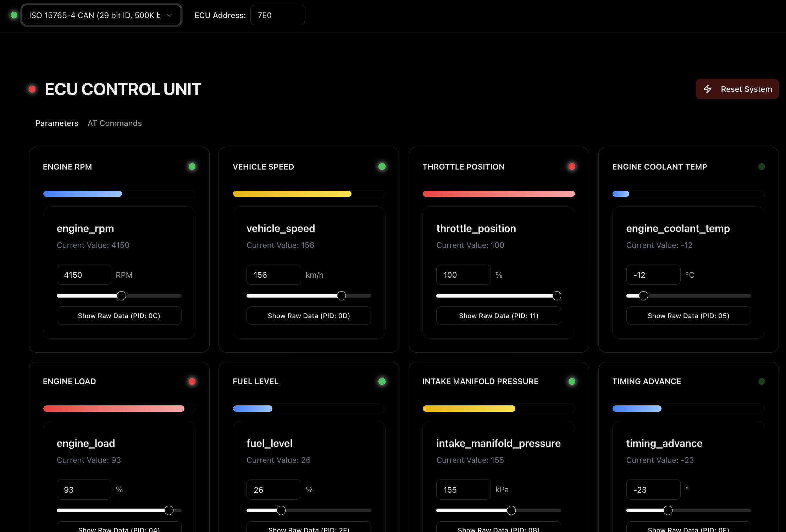

# ELM327 Emulator Web API 🚗 

<div align="center">

[](https://fastapi.tiangolo.com/)
[](https://www.python.org/)
[](https://nextjs.org/)
[](https://www.typescriptlang.org/)
[](https://bun.sh/)

A modern web-based ELM327 emulator with an intuitive GUI control panel. Monitor and control your virtual OBD-II parameters in real-time! 🚀

[Features](#features) • [Quick Start](#quick-start) • [Documentation](#api-documentation) • [Contributing](#contributing)



</div>

## ✨ Features

- 🎯 **Interactive GUI Dashboard** - Real-time monitoring of all ECU parameters
- 🚀 **FastAPI Backend** - High-performance ELM327 emulation
- 💻 **Modern Next.js Frontend** - Sleek, responsive control panel with shadcn/ui components
- 🐳 **Docker Ready** - Easy deployment with Docker Compose
- 📊 **Real-time Updates** - Live parameter visualization
- 🛠️ **Customizable Parameters** - Modify ECU values on the fly
- 🌓 **Dark/Light Mode** - Built-in theme support

## 🏁 Quick Start

### Using Docker (Recommended)

```bash
# Clone the repository
git clone <repository-url>
cd ELM327-emulator-web-API

# Start the application
docker compose up --build
```

Visit:
- 🌐 GUI Dashboard: http://localhost:3000
- 📚 API Docs: http://localhost:8000/docs

### Manual Setup

**Backend:**
```bash
pip install -r requirements.txt
uvicorn app.main:app --reload
```

**Frontend:**
```bash
cd control-panel
bun install
bun run dev
```

## 🎮 GUI Features

- **Real-time Dashboard**: Monitor all ECU parameters at a glance
- **Parameter Controls**: Adjust values using intuitive sliders and inputs
- **Command Console**: Send raw OBD-II commands
- **Response History**: Track command history and responses
- **Protocol Selection**: Switch between different OBD protocols
- **Dark/Light Theme**: Choose your preferred visual style with system theme support

## 🔧 Available ECU Parameters

| Parameter | Range | Unit |
|-----------|-------|------|
| Engine RPM | 0-8000 | RPM |
| Vehicle Speed | 0-255 | km/h |
| Throttle Position | 0-100 | % |
| Engine Coolant Temp | -40 to 215 | °C |
| Engine Load | 0-100 | % |
| Fuel Level | 0-100 | % |
| Manifold Pressure | 0-255 | kPa |
| Timing Advance | -64 to 63.5 | ° |
| O2 Sensor Voltage | 0-1.275 | V |
| Mass Air Flow | 0-655.35 | g/s |

## 🌐 API Endpoints

<details>
<summary>View Available Endpoints</summary>

### Command Execution
```http
POST /api/v1/command
```

### Parameter Control
```http
POST /api/v1/ecu/set-value
GET /api/v1/ecu/values
GET /api/v1/ecu/value/{parameter}
```
</details>

## 📦 Tech Stack

- **Backend**: FastAPI, Python 3.10+
- **Frontend**: Next.js 14, TypeScript, shadcn/ui
- **Package Manager**: Bun
- **Containerization**: Docker
- **Documentation**: Swagger/OpenAPI
- **Testing**: pytest

## 🛠️ Development

```bash
# Install development dependencies
pip install -r requirements-dev.txt

# Run tests
pytest

# Run linting
flake8
```

## 📝 Environment Variables

Create `.env`:
```env
API_HOST=0.0.0.0
API_PORT=8000
API_RELOAD=True
NEXT_PUBLIC_API_URL=http://localhost:8000
```

## 🤝 Contributing

1. Fork the repository
2. Create feature branch (`git checkout -b feature/AmazingFeature`)
3. Commit changes (`git commit -m 'Add AmazingFeature'`)
4. Push to branch (`git push origin feature/AmazingFeature`)
5. Open a Pull Request

## 📜 License

This project is licensed under the MIT License - see the [LICENSE](LICENSE) file for details.

## 🙏 Acknowledgments

- Built on top of the excellent [ELM327-emulator](https://github.com/Ircama/ELM327-emulator) library
- Inspired by professional automotive diagnostic tools
- UI components from [shadcn/ui](https://ui.shadcn.com/)

---

<div align="center">
Made with ❤️ by <a href="https://github.com/rakshitbharat">rakshitbharat</a>

⭐️ Star us on GitHub if you find this useful!
</div>