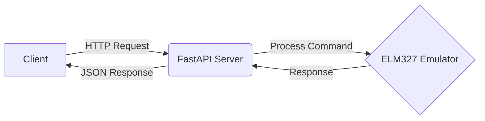

# ELM327 Emulator Web API 🔧🌐

[](https://fastapi.tiangolo.com/)
[](https://www.python.org/)

A modern web API interface for automotive diagnostics, wrapping the [ELM327-emulator](https://github.com/Ircama/ELM327-emulator) project with RESTful capabilities.



## Features 🚀

- 💻 RESTful API endpoints for OBD-II command emulation
- 📚 Interactive Swagger/OpenAPI documentation
- ⚡ Real-time command processing with FastAPI
- 🔒 Type-safe Python implementation
- 📦 Docker container support
- 📈 Built-in request validation

## Requirements 📋

- Python 3.6 or higher
- Docker (optional, for containerized deployment)

## Quick Start 🛠️

### Local Development

```bash
# Clone repository
git clone https://github.com/rakshitbharat/ELM327-emulator-web-API.git
cd ELM327-emulator-web-API

# Create and activate virtual environment (recommended)
python -m venv venv
source venv/bin/activate  # On Windows: venv\Scripts\activate

# Install dependencies
pip install -r requirements.txt

# Start development server
uvicorn app.main:app --reload
```

### Docker Deployment

```bash
# Build image
docker build -t elm-api .

# Run container
docker run -p 8000:8000 elm-api
```

Visit the interactive API docs: http://localhost:8000/docs

## API Endpoints 🌐

### Send Command

`POST /api/v1/command`

**Request:**

```json
{
  "command": "ATZ",
  "protocol": "auto"
}
```

**Success Response:**

```json
{
  "status": "success",
  "response": "ELM327 v1.5",
  "execution_time": 0.12
}
```

**Error Response:**

```json
{
  "status": "error",
  "error": "Invalid command format",
  "code": 400
}
```

## Dependencies 📦

Core dependencies:

- FastAPI (0.83.0)
- Uvicorn (0.16.0)
- ELM327-emulator
- Python-dotenv (0.20.0)
- Pydantic (1.x)
- Mangum (0.12.0)
- Boto3 (1.9+)

For a complete list of dependencies, see `requirements.txt`.

## Project Structure 📂

```
├── app/
│   ├── __init__.py
│   ├── main.py         # FastAPI application entrypoint
│   └── elm327_wrapper.py # ELM327 emulator wrapper
├── Dockerfile          # Docker configuration
├── requirements.txt    # Python dependencies
└── README.md          # Project documentation
```

## Environment Setup ⚙️

Create `.env` file for local development:

```env
# FastAPI Configuration
API_HOST=0.0.0.0
API_PORT=8000
API_RELOAD=True
```

## Compatibility Notes 📝

- The application is tested with Python 3.6
- All dependencies are pinned to versions compatible with Python 3.6
- The ELM327 emulator is configured in batch mode for better performance
- Docker deployment uses Python 3.6-slim base image

## Contributing 🤝

Contributions welcome! This is an open source project free to use and modify.

1. Fork the repository
2. Create your feature branch
3. Commit your changes
4. Push to the branch
5. Create a Pull Request

## Troubleshooting 🔧

Common issues and solutions:

1. **Import Errors**: Make sure you're using Python 3.6 or higher
2. **Docker Issues**: Ensure Docker is running and port 8000 is available
3. **Dependency Conflicts**: Use a virtual environment for clean installation

## License 📄

This project is licensed under the same terms as the original ELM327-emulator project.

---

Made with ❤️ by [rakshitbharat]
