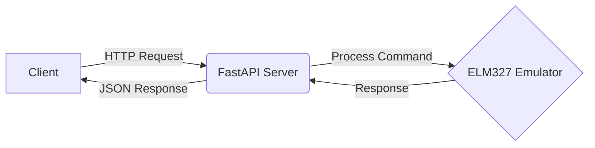

# ELM327 Emulator Web API 🔧🌐

[](https://fastapi.tiangolo.com/)
[](https://www.python.org/)

A modern web API interface for automotive diagnostics, wrapping the [ELM327-emulator](https://github.com/Ircama/ELM327-emulator) project with RESTful capabilities.



## Features 🚀

- 💻 RESTful API endpoints for OBD-II command emulation
- 📚 Interactive Swagger/OpenAPI documentation
- ⚡ Real-time command processing with FastAPI
- 🔒 Type-safe Python implementation
- 📦 Docker container support
- 📈 Built-in request validation

## Quick Start 🛠️

```bash
# Clone repository
git clone https://github.com/rakshitbharat/ELM327-emulator-web-API.git
cd ELM327-emulator-web-API

# Install dependencies
pip install -r requirements.txt

# Start development server
uvicorn app.main:app --reload
```

Visit the interactive API docs: http://localhost:8000/docs

## API Endpoints ��

### Send Command

`POST /api/v1/command`

**Request:**

```json
{
  "command": "ATZ",
  "protocol": "auto"
}
```

**Success Response:**

```json
{
  "status": "success",
  "response": "ELM327 v1.5",
  "execution_time": 0.12
}
```

**Error Response:**

```json
{
  "status": "error",
  "error": "Invalid command format",
  "code": 400
}
```

## Development 🧪

```bash
# Run tests
pytest tests/

# Format code
black .

# Check code quality
flake8
```

## Deployment 🚢

```bash
# Build Docker image
docker build -t elm327-emulator .

# Run container
docker run -d -p 8000:8000 elm327-emulator
```

## Contributing 🤝

Contributions welcome! This is an open source project free to use and modify.

---

Made with ❤️ by [rakshitbharat] | [Documentation](https://github.com/rakshitbharat/ELM327-emulator-web-API/wiki) | [Report Bug](https://github.com/rakshitbharat/ELM327-emulator-web-API/issues)
